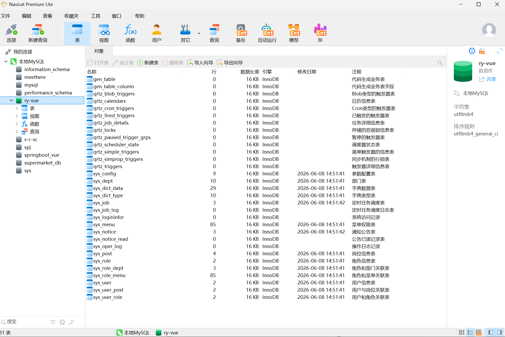
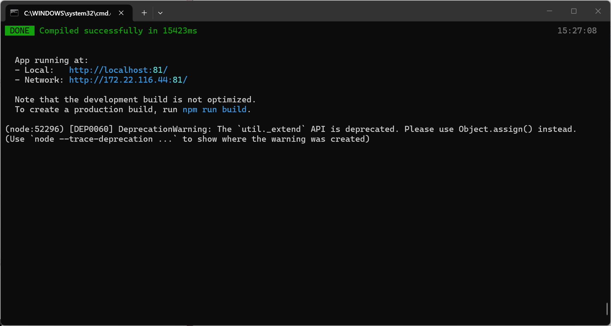
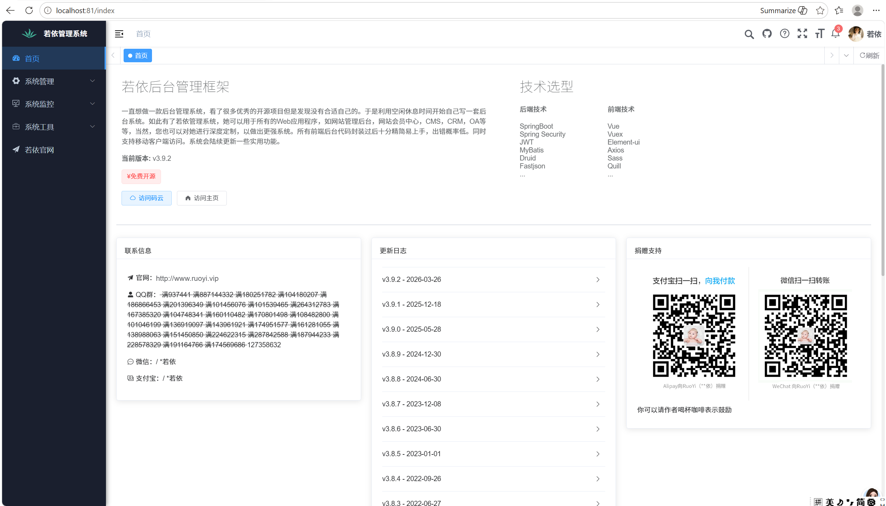

# RuoYi-Vue 企业级管理系统 测试实践

## 项目背景
本项目基于开源企业级权限管理系统 RuoYi-Vue 搭建本地测试靶场，完整开展了功能测试、接口测试与专项安全测试，旨在熟悉企业级 Web 系统的全流程测试方法，并沉淀可复用的测试用例与缺陷报告。

## 环境部署记录
项目已在本地完成完整部署，环境信息如下：
- 操作系统：Windows 10
- MySQL 版本：8.0
- Redis 版本：5.0
- Node.js 版本：v16.x
- JDK 版本：1.8

### 部署关键截图
#### 1. 数据库部署
Navicat 中成功连接本地 MySQL，`ry-vue` 数据库及所有系统表创建完成，SQL 脚本导入无报错。

#### 2. 前后端项目启动
后端 SpringBoot 项目启动成功，前端 `npm run dev` 编译完成，服务运行在 `localhost:81`。

#### 3. 系统访问界面
浏览器成功访问登录页，使用默认账号 `admin/admin123` 登录后进入系统首页。

## 测试工作内容
1.  **功能测试**：基于 XMind 梳理模块业务逻辑，输出功能测试用例 120+ 条，覆盖登录鉴权、用户/角色/部门管理等核心模块。
2.  **接口测试**：使用 Postman 对登录、用户 CRUD 等核心接口进行测试，通过 Token 校验、环境变量实现接口联动，并结合 MySQL 校验数据一致性。
3.  **缺陷管理**：测试过程中发现并记录 14 个功能与安全缺陷（如越权访问、异常输入校验缺失等），通过缺陷报告闭环跟踪。

## 项目交付物
- [部署环境记录](docs/01_部署记录/使用环境记录.md)
- [功能测试用例](docs/02_测试用例/功能测试用例.xlsx)（待上传）
- [缺陷报告](docs/04_缺陷管理/缺陷清单.xlsx)（待上传） 
